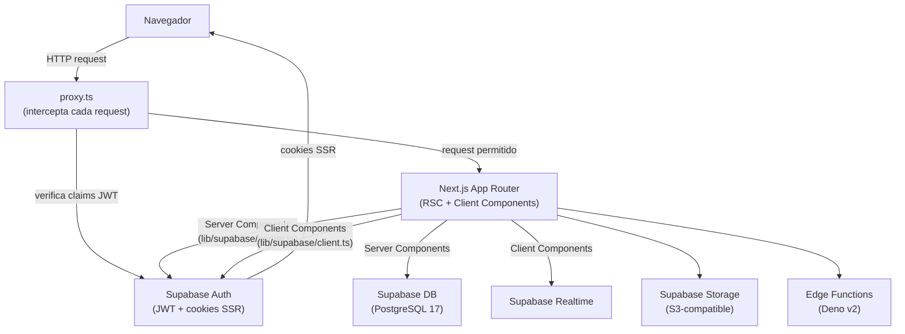

# Arquitetura do sistema

## Visão geral

SouJunior é uma aplicação full-stack construída com Next.js 16 e Supabase. O frontend é renderizado no servidor (SSR/RSC) e se comunica com o Supabase diretamente — não há camada de API customizada além das duas rotas de callback de autenticação.



## Grupos do App Router

| Grupo | Caminho | Propósito |
|-------|---------|-----------|
| `(landing-page)` | `/` | Landing page pública (marketing) |
| `(platform)` | `/login`, `/dashboard` | Interface do produto |
| `api/auth` | `/api/auth/callback`, `/api/auth/confirm` | Callbacks de auth (OAuth + OTP) |
| `dev` | `/dev/*` | Rotas exclusivas de desenvolvimento |

Os grupos entre parênteses não afetam a URL — servem apenas para organizar layouts e convenções.

## Camadas do frontend

```
Rotas (app/)
  └── Feature Components (app/**/_components/)
        └── components/common/   ← compostos reutilizáveis
              └── components/ui/ ← primitivos shadcn
```

A regra de promoção está documentada em `CLAUDE.md`: um componente nasce na feature; após a terceira reutilização em features diferentes, sobe para `components/common/`.

## Next.js 16 — diferenças importantes

**`proxy.ts` em vez de `middleware.ts`**
O arquivo de interceptação de requests chama-se `proxy.ts` e exporta a função `proxy` (não `middleware`). Esta é uma mudança de convenção do Next.js 16. Ver `proxy.ts:4`.

**`authInterrupts` experimental**
Habilitado em `next.config.ts`. Permite que Server Actions lancem exceções que redirecionam automaticamente para páginas de erro de auth (`/unauthorized`, `/forbidden`).

**`supabase.auth.getClaims()`**
Em vez de `getUser()` (que faz uma requisição remota), o proxy usa `getClaims()` para validar a sessão a partir do JWT local — mais performático para verificações em cada request.

## shadcn base-nova — diferença importante

O estilo selecionado é `base-nova` (`components.json:2`). Ao contrário do estilo padrão `default`, este usa `@base-ui/react` em vez de Radix UI. A API dos componentes difere:

- Composição via prop `render` em vez de `asChild`
- Atributos de estado como `data-checked`, `data-open` em vez de variantes Radix
- Ver memória de projeto: `feedback_shadcn_base_nova.md`

## Autenticação — fluxo de sessão

A sessão é mantida via cookies HttpOnly gerenciados pelo `@supabase/ssr`. O padrão é:

1. **Server Components** usam `lib/supabase/server.ts` — lê cookies do request
2. **Client Components** usam `lib/supabase/client.ts` — singleton no browser
3. **`proxy.ts`** usa `createServerClient` direto — intercepta antes do App Router
4. **`UserProvider`** (`lib/auth/user-provider.tsx`) mantém estado de usuário no client com listener `onAuthStateChange`

O `RootLayout` (`app/layout.tsx`) faz `supabase.auth.getUser()` no servidor para hidratar o `UserProvider` com o usuário inicial, evitando flash de estado não-autenticado.

## Serviços Supabase utilizados

| Serviço | Uso |
|---------|-----|
| Auth | Email/senha, Google OAuth, OTP por e-mail, gestão de sessão |
| PostgreSQL 17 | Banco de dados principal (porta 54322 em dev) |
| Storage | Upload de arquivos (limite: 50 MiB, protocolo S3) |
| Realtime | Assinaturas em tempo real (habilitado, sem uso atual confirmado) |
| Edge Functions | Runtime Deno v2 (diretório presente, sem funções implementadas) |

## Path aliases (TypeScript)

Configurados em `tsconfig.json` e espelhados em `vitest.config.ts`:

| Alias | Caminho real |
|-------|-------------|
| `@/*` | `./` (raiz do projeto) |
| `@components/*` | `./components/*` |
| `@hooks/*` | `./hooks/*` |
| `@lib/*` | `./lib/*` |

Use os aliases nos imports em vez de caminhos relativos longos (`../../lib/auth/...`).

## Infraestrutura de testes

| Ferramenta | Config | Escopo |
|------------|--------|--------|
| **Vitest** | `vitest.config.ts` | Testes unitários — arquivos `**/__tests__/**/*.{ts,tsx}` e `**/*.test.{ts,tsx}`; ambiente Node |
| **Playwright** | `playwright.config.ts` | Testes E2E — diretório `e2e/`; executa contra `http://localhost:3000` no Chromium |

Em CI, o Playwright usa `retries: 2` e `workers: 1`. O `webServer` do config inicia `npm run dev` automaticamente antes dos testes se o servidor não estiver rodando.

## Decisões técnicas identificáveis no código

| Decisão | Evidência |
|---------|-----------|
| SSR cookies para sessão (não localStorage) | `lib/supabase/server.ts`, `proxy.ts` |
| Singleton para cliente browser | `lib/supabase/client.ts` — `let client` no módulo |
| Validação com Zod v4 | `lib/validations/auth.ts` — import `from "zod"` (v4 ≥ 4.0) |
| Formulários com react-hook-form | `lib/validations/auth.ts` exporta schemas + types |
| Redirecionamento seguro (anti-open-redirect) | `lib/auth/safe-redirect.ts` |
| Idioma pt-BR como padrão | `app/layout.tsx:48` (`lang="pt-br"`), mensagens de erro em português |
| Three.js para visualização 3D | `components/HeroRede.tsx`, deps: `three`, `@react-three/fiber`, `@react-three/drei` |
