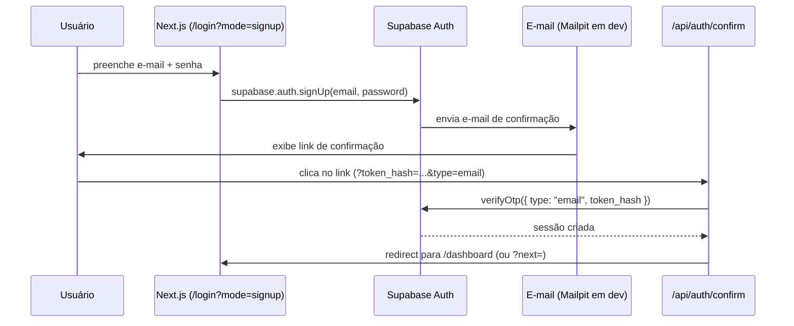
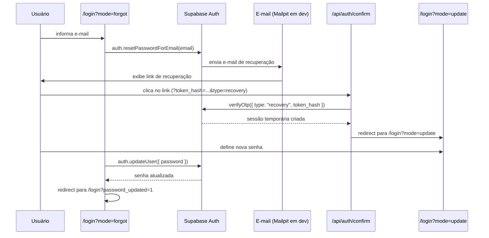

# Autenticação e autorização

## Modos de autenticação

A página `/login` é uma tela unificada que suporta quatro modos, selecionados via query param `?mode=`:

| Modo | URL | Descrição |
|------|-----|-----------|
| `signin` | `/login` ou `/login?mode=signin` | Login com e-mail e senha (padrão) |
| `signup` | `/login?mode=signup` | Cadastro com confirmação por e-mail |
| `forgot` | `/login?mode=forgot` | Solicitar link de recuperação de senha |
| `update` | `/login?mode=update` | Redefinir senha (após clicar no link do e-mail) |

O helper `getAuthMode()` em `lib/auth/mode.ts` converte strings inválidas para `"signin"` por padrão.

## Fluxo: cadastro com confirmação de e-mail



O template do e-mail de confirmação está em `supabase/templates/confirmation.html`.

## Fluxo: recuperação de senha



O template do e-mail de recuperação está em `supabase/templates/recovery.html`.

## Google OAuth

Configurado em `supabase/config.toml` (seção `[auth.external.google]`) com as variáveis:

```
SUPABASE_AUTH_EXTERNAL_GOOGLE_CLIENT_ID=<client-id>
SUPABASE_AUTH_EXTERNAL_GOOGLE_CLIENT_SECRET=<client-secret>
```

O callback OAuth retorna para `/api/auth/callback?code=<code>&next=<path>`. O handler em `app/api/auth/callback/route.ts` troca o código por uma sessão via `supabase.auth.exchangeCodeForSession(code)`.

## Roles de usuário

As roles são armazenadas em `app_metadata.role` no JWT do Supabase. Esse campo só pode ser escrito pelo servidor (service role key) — nunca pelo próprio usuário.

| Valor | Rota de console | Acesso |
|-------|-----------------|--------|
| `ADMIN` | `/admin` | Painel de administração |
| `SUPER_ADMIN` | `/super-admin` | Painel de super-administração (inclui auditoria) |
| `MODERATOR` | `/moderator` | Painel de moderação de conteúdo |
| _(ausente)_ | `/dashboard` | Usuário comum autenticado |

Para ler a role no servidor:

```ts
const { data } = await supabase.auth.getClaims();
const role = data?.claims?.app_metadata?.role as string | undefined;
```

## Roteamento por role — `getDashboardByRole`

`lib/auth/dashboard-route.ts` exporta `getDashboardByRole(role?)`:

| `role` | Retorna |
|--------|---------|
| `"SUPER_ADMIN"` | `/super-admin` |
| `"ADMIN"` | `/admin` |
| `"MODERATOR"` | `/moderator` |
| qualquer outro / `undefined` | `/dashboard` |

Usada por `proxy.ts`, `signInWithEmail`, `app/api/auth/callback` e `app/api/auth/confirm` para determinar o destino do redirect após autenticação bem-sucedida.

## Proteção de rotas por role

Cada área de console tem um `layout.tsx` que:

1. Chama `supabase.auth.getClaims()` server-side
2. Lê `data?.claims?.app_metadata?.role`
3. Redireciona para `/dashboard` se a role não corresponder (não para `/login`)

```
app/(platform)/admin/layout.tsx        → role !== "ADMIN"       → redirect("/dashboard")
app/(platform)/super-admin/layout.tsx  → role !== "SUPER_ADMIN" → redirect("/dashboard")
app/(platform)/moderator/layout.tsx    → role !== "MODERATOR"   → redirect("/dashboard")
```

Não há verificação no `proxy.ts` para essas rotas — a proteção é exclusivamente no layout server-side.

## Proteção de rotas

### `proxy.ts` — verificação em cada request

O arquivo `proxy.ts` (equivalente ao `middleware.ts` do Next.js 16) intercepta todos os requests e trata dois cenários:

**Usuário autenticado em `/login`:** se houver claims válidos e `mode !== "update"`, redireciona para a rota correspondente à role via `getDashboardByRole()`. Se houver um `?next=` válido (caminho relativo que não comece com `/login`), redireciona para ele. O modo `?mode=update` (redefinir senha) é exceção — permite que o usuário permaneça em `/login`.

**Rota `/dashboard` ou `/dashboard/*` sem sessão:**

1. Chama `supabase.auth.getClaims()` — valida o JWT localmente sem round-trip remoto
2. Se não houver claims: redireciona para `/login?next=<path-original>`
3. O parâmetro `next` é sanitizado por `getSafeRedirectPath()` antes de ser usado

### `DashboardLayout` — segunda camada de proteção

O layout `app/(platform)/dashboard/layout.tsx` faz uma segunda verificação server-side via `supabase.auth.getClaims()`. Esta redundância garante proteção mesmo que o proxy seja contornado.

### `ProfileLayout` — shell adaptado à role

O layout `app/(platform)/profile/layout.tsx` requer sessão ativa e renderiza o shell correto para a role do usuário:

| Role | Shell renderizado |
|------|------------------|
| `ADMIN` | `ConsoleShell` com `ADMIN_NAV` |
| `SUPER_ADMIN` | `ConsoleShell` com `SUPER_ADMIN_NAV` |
| `MODERATOR` | `ConsoleShell` com `MODERATOR_NAV` |
| _(sem role)_ | `DashboardShell` |

Isso garante que a página de perfil use a mesma navegação lateral que o console ou painel do usuário.

## Estado de usuário no cliente

`UserProvider` (`lib/auth/user-provider.tsx`) é montado no root layout (`app/layout.tsx`):

- Recebe o usuário inicial já obtido no servidor (evita flash de estado anônimo)
- Mantém sincronização via `supabase.auth.onAuthStateChange()`
- Expõe `useUser()` → `{ user: User | null, isLoading: boolean }`

```tsx
const { user, isLoading } = useUser();
```

## Server Actions de autenticação

Todas as operações de auth da página `/login` são executadas por Server Actions em `app/(platform)/login/_lib/server/actions.ts`:

| Função | Descrição |
|--------|-----------|
| `signInWithEmail(values, next?)` | Login com e-mail e senha; redireciona para `next` se fornecido, senão para a rota da role via `getDashboardByRole()` |
| `signUpWithEmail(values, next?)` | Cadastro; retorna mensagem de sucesso se e-mail pendente |
| `startGoogleSignIn(next?)` | Gera URL do OAuth Google e retorna `{ status: "redirect", url }` |
| `requestPasswordRecovery(values)` | Envia e-mail de recuperação via `auth.resetPasswordForEmail()` |
| `updatePassword(values)` | Atualiza senha, faz sign-out e redireciona para `/login?password_updated=1` |
| `signOut()` | Encerra sessão e redireciona para `/login` |

Cada função valida os dados com os schemas Zod de `lib/validations/auth.ts` antes de chamar o Supabase.

Há também `signOutAction()` em `lib/server/auth.ts` — versão simplificada usada fora do contexto da página de login.

## Sign-out

Server Action em `lib/server/auth.ts`:

```ts
await signOutAction(); // chama supabase.auth.signOut() e redireciona para /login
```

## Clientes Supabase

| Arquivo | Quando usar |
|---------|-------------|
| `lib/supabase/server.ts` | Server Components, Server Actions, Route Handlers |
| `lib/supabase/client.ts` | Client Components (browser) |
| `lib/supabase/admin.ts` | Server Actions que precisam da Supabase Admin API (service role key) |

Nunca use o cliente de servidor em Client Components — ele depende de `cookies()` do Next.js, que não existe no browser.

`createAdminClient()` usa `SUPABASE_SECRET_KEY` (service role) com `autoRefreshToken: false` e `persistSession: false` — nunca use no browser e nunca exponha a chave com prefixo `NEXT_PUBLIC_`.

## Schemas de validação (Zod v4)

Arquivo: `lib/validations/auth.ts`

| Schema | Campos | Regras |
|--------|--------|--------|
| `signInSchema` | `email`, `password` | email válido, senha obrigatória |
| `signUpSchema` | `email`, `password`, `passwordConfirmation` | senha ≥ 8 chars, confirmação deve coincidir |
| `forgotPasswordSchema` | `email` | email válido |
| `updatePasswordSchema` | `password`, `passwordConfirmation` | senha ≥ 8 chars, confirmação deve coincidir |

### `lib/validations/admin.ts`

| Schema | Campos | Regras |
|--------|--------|--------|
| `updateRoleSchema` | `userId`, `newRole` | `userId` deve ser UUID v4; `newRole` deve ser um dos valores de `USER_ROLES` (`SUPER_ADMIN`, `ADMIN`, `MODERATOR`, `USER`) |
| `banUserSchema` | `userId` | `userId` deve ser UUID v4 |

### `lib/validations/profile.ts`

| Schema | Campos | Regras |
|--------|--------|--------|
| `profileSchema` | `displayName`, `avatarPhoto` | `displayName`: 3–32 chars com trim aplicado; `avatarPhoto`: string não-vazia |

## Server Actions administrativas (`lib/actions/admin.ts`)

Executadas no servidor com a Supabase Admin API via `createAdminClient()`. Cada função verifica internamente que o chamador tem role `ADMIN` ou `SUPER_ADMIN`.

| Função | Descrição |
|--------|-----------|
| `listUsers(options?)` | Lista usuários paginados; suporta busca por nome/e-mail e filtro por status. Quando há filtro ativo, busca todas as páginas antes de filtrar. |
| `getUserById(userId)` | Retorna dados de um usuário por ID. |
| `banUser(userId)` | Define `ban_duration: "87600h"` e `status: "banido"` no `app_metadata`. Admins não podem banir Super Admins. |
| `unbanUser(userId)` | Remove o ban (`ban_duration: "none"`) e restaura `status: "ativo"`. |
| `updateUserRole(userId, newRole)` | Altera a role no `app_metadata`. Admins só podem promover usuários comuns para Moderador. |

Todas retornam `{ status: "success" | "error", message: string, data?: T }`.

## Server Actions de perfil (`lib/actions/profile.ts`)

Executadas no servidor com o cliente padrão (`createClient()`). Requerem sessão ativa.

| Função | Descrição |
|--------|-----------|
| `updateProfile(values)` | Atualiza `display_name` e `avatar_photo` em `user_metadata` via `auth.updateUser()`. Valida com `profileSchema`. |
| `disconnectIdentity(identityId)` | Desvincula uma identidade OAuth do usuário via `auth.unlinkIdentity()`. |
| `linkGoogleIdentity()` | Inicia vinculação de conta Google via `auth.linkIdentity({ provider: "google" })`. Retorna `{ status: "redirect", url }`. |
| `linkDiscordIdentity()` | Inicia vinculação de conta Discord via `auth.linkIdentity({ provider: "discord" })`. Retorna `{ status: "redirect", url }`. |

## Erros de autenticação

Mensagens mapeadas para pt-BR em `lib/auth/error-message.ts`. Chegam à página via query param `?error=<código>` (ex.: `?error=oauth_callback`, `?error=recovery_link_invalid`).

## Segurança: prevenção de open redirect

`lib/auth/safe-redirect.ts` exporta duas funções:

**`getSafeRedirectPath(value?)`** — valida todo valor de `?next=`:

- Rejeita URLs absolutas (ex.: `https://site-malicioso.com`)
- Aceita apenas caminhos relativos começando com `/`
- Fallback para `/dashboard` em caso de valor inválido

**`buildAuthCallbackUrl(origin, next?)`** — constrói a URL de retorno para OAuth e e-mails de confirmação. Usa `getSafeRedirectPath()` internamente para garantir que o `next` inserido no link de e-mail seja sempre um caminho relativo válido.
