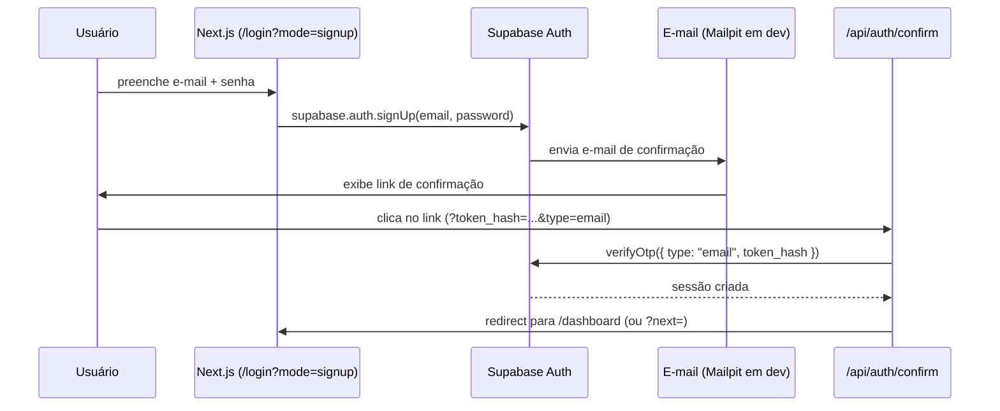
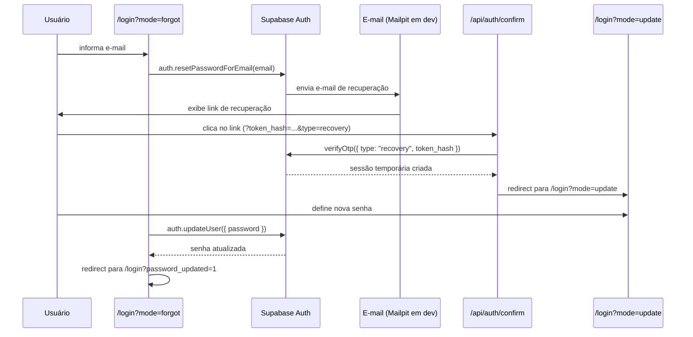

# Autenticação e autorização

## Modos de autenticação

A página `/login` é uma tela unificada que suporta quatro modos, selecionados via query param `?mode=`:

| Modo | URL | Descrição |
|------|-----|-----------|
| `signin` | `/login` ou `/login?mode=signin` | Login com e-mail e senha (padrão) |
| `signup` | `/login?mode=signup` | Cadastro com confirmação por e-mail |
| `forgot` | `/login?mode=forgot` | Solicitar link de recuperação de senha |
| `update` | `/login?mode=update` | Redefinir senha (após clicar no link do e-mail) |

O helper `getAuthMode()` em `lib/auth/mode.ts` converte strings inválidas para `"signin"` por padrão.

## Fluxo: cadastro com confirmação de e-mail



O template do e-mail de confirmação está em `supabase/templates/confirmation.html`.

## Fluxo: recuperação de senha



O template do e-mail de recuperação está em `supabase/templates/recovery.html`.

## Google OAuth

Configurado em `supabase/config.toml` (seção `[auth.external.google]`) com as variáveis:

```
SUPABASE_AUTH_EXTERNAL_GOOGLE_CLIENT_ID=<client-id>
SUPABASE_AUTH_EXTERNAL_GOOGLE_CLIENT_SECRET=<client-secret>
```

O callback OAuth retorna para `/api/auth/callback?code=<code>&next=<path>`. O handler em `app/api/auth/callback/route.ts` troca o código por uma sessão via `supabase.auth.exchangeCodeForSession(code)`.

## Proteção de rotas

### `proxy.ts` — verificação em cada request

O arquivo `proxy.ts` (equivalente ao `middleware.ts` do Next.js 16) intercepta todos os requests. Para rotas `/dashboard` e `/dashboard/*`:

1. Chama `supabase.auth.getClaims()` — valida o JWT localmente sem round-trip remoto
2. Se não houver claims: redireciona para `/login?next=<path-original>`
3. O parâmetro `next` é sanitizado por `getSafeRedirectPath()` antes de ser usado

### `DashboardLayout` — segunda camada de proteção

O layout `app/(platform)/dashboard/layout.tsx` faz uma segunda verificação server-side via `supabase.auth.getClaims()`. Esta redundância garante proteção mesmo que o proxy seja contornado.

## Estado de usuário no cliente

`UserProvider` (`lib/auth/user-provider.tsx`) é montado no root layout (`app/layout.tsx`):

- Recebe o usuário inicial já obtido no servidor (evita flash de estado anônimo)
- Mantém sincronização via `supabase.auth.onAuthStateChange()`
- Expõe `useUser()` → `{ user: User | null, isLoading: boolean }`

```tsx
const { user, isLoading } = useUser();
```

## Server Actions de autenticação

Todas as operações de auth da página `/login` são executadas por Server Actions em `app/(platform)/login/_lib/server/actions.ts`:

| Função | Descrição |
|--------|-----------|
| `signInWithEmail(values, next?)` | Login com e-mail e senha; redireciona para `next` em sucesso |
| `signUpWithEmail(values, next?)` | Cadastro; retorna mensagem de sucesso se e-mail pendente |
| `startGoogleSignIn(next?)` | Gera URL do OAuth Google e retorna `{ status: "redirect", url }` |
| `requestPasswordRecovery(values)` | Envia e-mail de recuperação via `auth.resetPasswordForEmail()` |
| `updatePassword(values)` | Atualiza senha, faz sign-out e redireciona para `/login?password_updated=1` |
| `signOut()` | Encerra sessão e redireciona para `/login` |

Cada função valida os dados com os schemas Zod de `lib/validations/auth.ts` antes de chamar o Supabase.

Há também `signOutAction()` em `lib/server/auth.ts` — versão simplificada usada fora do contexto da página de login.

## Sign-out

Server Action em `lib/server/auth.ts`:

```ts
await signOutAction(); // chama supabase.auth.signOut() e redireciona para /login
```

## Clientes Supabase

| Arquivo | Quando usar |
|---------|-------------|
| `lib/supabase/server.ts` | Server Components, Server Actions, Route Handlers |
| `lib/supabase/client.ts` | Client Components (browser) |

Nunca use o cliente de servidor em Client Components — ele depende de `cookies()` do Next.js, que não existe no browser.

## Schemas de validação (Zod v4)

Arquivo: `lib/validations/auth.ts`

| Schema | Campos | Regras |
|--------|--------|--------|
| `signInSchema` | `email`, `password` | email válido, senha obrigatória |
| `signUpSchema` | `email`, `password`, `passwordConfirmation` | senha ≥ 8 chars, confirmação deve coincidir |
| `forgotPasswordSchema` | `email` | email válido |
| `updatePasswordSchema` | `password`, `passwordConfirmation` | senha ≥ 8 chars, confirmação deve coincidir |

## Erros de autenticação

Mensagens mapeadas para pt-BR em `lib/auth/error-message.ts`. Chegam à página via query param `?error=<código>` (ex.: `?error=oauth_callback`, `?error=recovery_link_invalid`).

## Segurança: prevenção de open redirect

`lib/auth/safe-redirect.ts` exporta duas funções:

**`getSafeRedirectPath(value?)`** — valida todo valor de `?next=`:

- Rejeita URLs absolutas (ex.: `https://site-malicioso.com`)
- Aceita apenas caminhos relativos começando com `/`
- Fallback para `/dashboard` em caso de valor inválido

**`buildAuthCallbackUrl(origin, next?)`** — constrói a URL de retorno para OAuth e e-mails de confirmação. Usa `getSafeRedirectPath()` internamente para garantir que o `next` inserido no link de e-mail seja sempre um caminho relativo válido.
